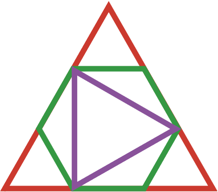

 

# SignalingDimension.jl

*Certify the classical simulation cost of signaling systems.*

This Julia package is the software companion piece to [Certifying the Classical Simulation Cost of a Quantum Channel](link to paper).

[](https://ChitambarLab.github.io/SignalingDimension.jl/dev/)

## Features:
* Tools to compute signaling correlations (see [Signaling Correlations](@ref)).
* Tools to assist signaling polytope computations (see [Signaling Polytopes](@ref)).
* A catalog of Bell inequalities for witnessing signaling dimension (see [Bell Inequalities](@ref)).
* Methods to certify the signaling dimension of signaling systems (see [Certifying Signaling Dimension](@ref)).


## Overview

The advent of quantum technology requires new figures of merit to compare the performance
of quantum and classical systems.
The signaling dimension quantifies the classical
simulation cost of black-box devices.
That is, it specifies the minimum amount of noiseless, classical communication
needed to exactly simulate the input-output statistics of the device in question.
The signaling dimension is discussed in greater detail in the Background section
of this documentation.

## Quick Start

Note: Until SignalingDimension.jl is registered, add the package by typing `]` to enter `pkg>` mode and entering

```julia
pkg> add https://github.com/ChitambarLab/SignalingDimension.jl.git
```

* Install Julia: [https://julialang.org/downloads/](https://julialang.org/downloads/)
* Add the SignalingDimension.jl package (run from julia prompt):

```
julia> using Pkg; Pkg.add("SignalingDimension")
```

* Add BellScenario.jl and QBase.jl dependencies:

```
julia> using Pkg; Pkg.add("BellScenario")
julia> using Pkg; Pkg.add("QBase")
```

## Project Structure

* `data/` - Computed Bell inequalities for signaling polytopes.
* `docs/` - [Documentation](https://chitambarlab.github.io/SignalingDimension.jl/dev/) source code.
* `src/` - Software for certifying signaling dimension.
* `test/` - Unit tests for code in `src/`.
* `script/` - Code for data computation and verification.

## Citing

To reference this work, see [`CITATION.bib`](https://github.com/ChitambarLab/SignalingDimension.jl/blob/master/CITATION.bib).

## Licensing

SignalingDimension.jl is released under the MIT License.

## Acknowledgements

Development of SignalingDimension.jl was made possible by the advisory of Dr. Eric Chitambar and general support from the Physics Department at the University of Illinois Urbana-Champaign. Funding was provided by NSF Award 1914440.
