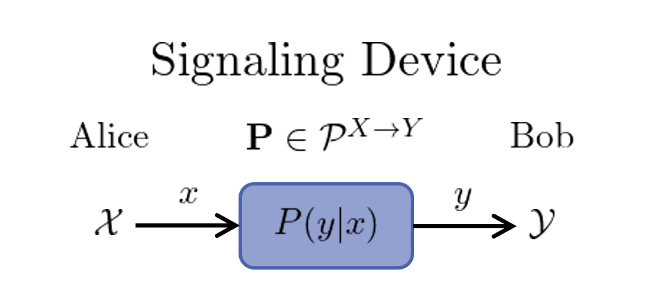
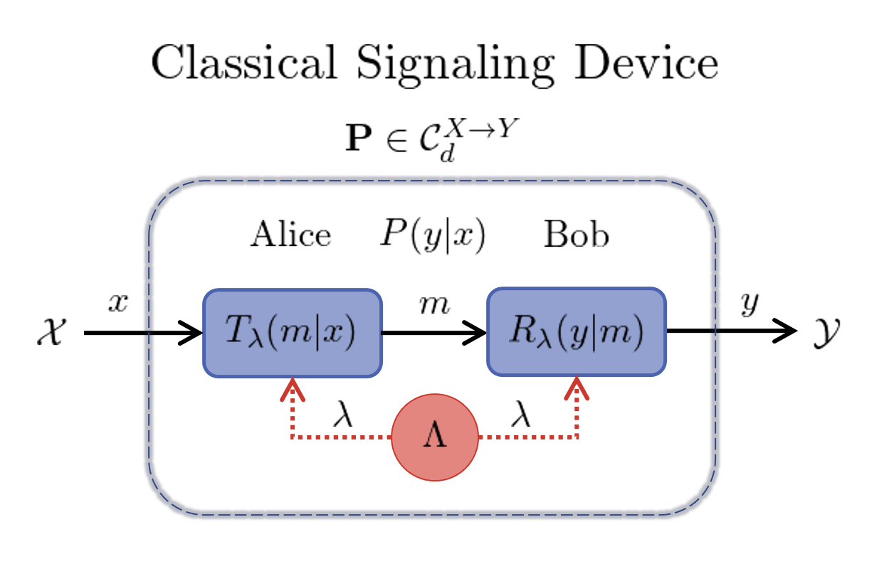

# Signaling Correlations

Consider a device that has a classical input ``x\in\mathcal{X}=[X]`` and classical
output ``y\in\mathcal{Y}=[Y]`` where ``[N]:=\{1,2,\cdots,N \}`` is a finite set of
positive integers.
The device is assumed to be causal, *i.e.* the output set ``\mathcal{Y}`` is computed
from the input ``\mathcal{X}``, however, no assumptions are made about how ``\mathcal{Y}``
is  computed  from  ``\mathcal{X}``.
Hence this device is regarded as a black-box and this description applies to all
classical technologies as well as many quantum systems used for computation and
communication.
Without loss of generality, any such black-box can be described as a *signaling device*
that transmits classical information from Alice to Bob.



The signaling device is effectively a classical channel with ``X`` inputs and ``Y``
outputs, however, the signaling process that takes ``\mathcal{X}\to \mathcal{Y}``
may use non-classical physics *e.g.* quantum physics.
Making no assumptions about the physical system inside the channel,
we can characterize its behavior by the conditional probabilities ``P(y|x)``.
We refer to these probabilities as *signaling correlations* and organize them
into a column stochastic matrix ``\mathbf{P}`` where ``P(y|x)`` is the
element in the ``y^{th}`` row and ``x^{th}`` column.
Hence ``\mathbf{P}`` represents a classical channel with ``X`` inputs and ``Y`` outputs
and we denote the set of all such classical channels as ``\mathcal{P}^{X\to Y}``.

The information capacity of a channel will typically be limited.
In the one-shot setting, we can quantify this value by ``d``, the number of distinct
classical messages used.
In a quantum system ``d`` corresponds to the Hilbert space dimension of
encoded quantum states.
For example, single bit or qubit communication corresponds to ``d=2``, while for general
``d`` we specify a single dit or qudit of communication.

To model such signaling devices, we apply the framework of [`BellScenario.jl`](https://chitambarlab.github.io/BellScenario.jl/stable/).
The signaling device is then described by the [`BellScenario.LocalSignaling`](https://chitambarlab.github.io/BellScenario.jl/stable/BellScenario/scenarios/#BellScenario.LocalSignaling)
scenario which specifies the number of inputs `X`, outputs `Y` and forward communication `d`.

```@example local_signaling_scenario
using BellScenario

X = 3    # num inputs
Y = 4    # num outputs
d = 2    # bit or qubit communication

scenario = LocalSignaling(X, Y, d)
```

Note that the constructed `LocalSignaling` type specifies the black-box configuration,
but not whether classical or quantum signaling is used.

## Classical Channels

In a classical setting, a `LocalSignaling` scenario decomposes as follows:
1. Alice (the transmitter) encodes input ``x`` into a single dit message ``m\in[d]``.
2. Message ``m`` is noiselessly sent from Alice to Bob.
3. Bob (the receiver) decodes message ``m`` to  produce output ``y``.

To assist in this protocol, Alice and Bob can use shared randomness to coordinate
their encoding and decoding maps.
This noiseless one-way communication protocol is depicted in the following image.



In the figure, ``T_{\lambda}(m|x)`` and ``R_{\lambda}(y|m)`` are the conditional probabilities
for the transmitter and receiver.
In fact, the transmitter and receiver can be represented as classical channels
``\mathbf{T}_{\lambda}\in\mathcal{P}^{X \to d}`` and ``\mathbf{R}_{\lambda} \in \mathcal{P}^{d \to Y}``.
Furthermore, ``\Lambda`` denotes the sample space from which  shared random variable ``\lambda``
is drawn with the probability ``q(\lambda)`` where ``\sum_{\lambda\in\Lambda} q(\lambda) = 1``.
The classical signaling correlations produced in a `LocalSignaling` scenario decompose
as

```math
P(y|x) = \sum_{\lambda\in\Lambda}q(\lambda)\mathbf{R}_\lambda\mathbf{T}_\lambda  = \sum_{\lambda\in\Lambda}q(\lambda) \sum_{m\in[d]}R_\lambda(y|m)T_\lambda(m|x).
```

The complete set of classical signaling correlations are denoted ``\mathcal{C}_d^{X \to Y}``.
Any classical channel ``\mathbf{P}`` satisfies ``\mathbf{P}\in\mathcal{C}_d^{X \to Y}\subset \mathcal{P}^{X \to Y}``.
The set ``\mathcal{C}_d^{X \to Y}`` forms a convex polytope regarded as the *signaling polytope*.
More details on the structure of the signaling polytope are found in the [Signaling Polytope: Overview](@ref) section.
In the BellScenario.jl framework a classical channel ``\mathbf{P}\in\mathcal{P}^{X\to Y}`` is then represented by
a [`BellScenario.AbstractStrategy`](https://chitambarlab.github.io/BellScenario.jl/dev/BellScenario/strategies/#BellScenario.AbstractStrategy) type where a `Strategy` is simply a column stochastic map.

### Code Example: Classical Signaling without Shared Randomness
```@example classical_channel_local_random
using BellScenario

X = 3    # num inputs
Y = 3    # num outputs
d = 2    # dit

scenario = LocalSignaling(X, Y, d)

T = Strategy([1 0 1;0 1 0])    # transmitter channel
R = Strategy([0 0;0 1;1 0])    # receiver channel

P = *(R, T, scenario)    # `Strategy` matrix multiplication : P = R*T
```

### Code Example: Classical Signaling with Shared Randomness
```@example classical_channel_shared_random
using BellScenario

X = 3    # num inputs
Y = 3    # num outputs
d = 2    # dit

scenario = LocalSignaling(X, Y, d)

# λ = 1 strategies
T1 = Strategy([1 0 1;0 1 0])    # transmitter channel 1
R1 = Strategy([0 0;0 1;1 0])    # receiver channel 1

# λ = 2 strategies
T2 = Strategy([0 0.5 1;1 0.5 0])    # transmitter channel 2
R2 = Strategy([1 0;0 1;0 0])        # receiver channel 2

Λ = [0.5, 0.5]    # shared random distribution

# `Strategy` matrix multiplication : P = R*T
P1 = *(R1, T1, scenario)
P2 = *(R2, T2, scenario)

# Convex combination of `P1` and `P2`
Strategy(sum( Λ .* [P1, P2] ), scenario)
```

## Quantum Channels

In a quantum setting a `LocalSignaling` scenario decomposes as follows:
1. Alice uses a classical-quantum encoder ``\Psi`` to transform input ``x`` into a quantum state ``\rho_x``.
2. Alice sends ``\rho_x`` to Bob through a quantum channel ``\mathcal{N}``.
3. Bob measures ``\mathcal{N}(\rho_x)`` with a positive operator-valued measure (POVM) ``\Pi = \{\Pi_y\}_{y\in\mathcal{Y}}`` produce output ``y``.

The amount of quantum communication is measured by the Hilbert space dimension of
``\rho_x``.
Additionally, the quantum channel ``\mathcal{N}`` performs a completely
positive trace-preserving (CPTP) map on the density matrix of ``\rho_x`` producing
a new quantum states ``\mathca{N}(\rho_x)``.
This quantum communication scheme is depicted in the following figure.


Note that the inputs and outputs are classical, hence, we discuss the classical
channel ``\mathbf{P}_{\mamthcal{N}}`` generated using quantum channel ``\mathcal{N}``.
The signaling correlations of a quantum signaling device are then expressed

```math
P_{\mathcal{N}}(y|x) = \text{Tr}[\Pi_y \mathcal{N}(\rho_x)],
```

for a  given set  of quantum states ``\{\rho_x\}_{x\in\mathcal{X}}`` and POVM ``\{\Pi_y\}_{y\in\mathcal{Y}}``.
The set of quantum channels generated for any choice of states and POVM is denoted
``\mathcal{Q}_{\mathcal{N}}^{X \to Y}`` where ``\mathbf{P}_{\mathcal{N}} \in\mathcal{Q}_{\mathcal{N}}^{X \to Y}\subset \mathcal{P}^{X \to Y}``.
For a noiseless quantum channel, ``\mathcal{N}`` is simply the ``d`` dimension identity matrix
and the signaling correlations are constructed as

```math
P(y|x) = \text{Tr}[\Pi_y \rho_x].
```

To numerically construct quantum signaling correlations, `BellScenario.jl` provides a [`quantum_strategy`](https://chitambarlab.github.io/BellScenario.jl/stable/BellScenario/strategies/#BellScenario.quantum_strategy) method.
As input this method requires states and POVMs to be represented by
[`QBase.States.AbstractDensityMatrix`](https://chitambarlab.github.io/QBase.jl/stable/submodules/States/#QBase.States.AbstractDensityMatrix)
and [`QBase.Observables.AbstractPOVM`](https://chitambarlab.github.io/QBase.jl/stable/submodules/Observables/#QBase.Observables.AbstractPOVM)
as defined in the [QBase.jl](https://chitambarlab.github.io/QBase.jl/stable/) package.

### Code Example: Signaling Over Quantum Channel

```@example quantum_signaling_channel
using BellScenario
using QBase

X = 3    # num inputs
Y = 3    # num outputs
d = 2    # qudit

scenario = LocalSignaling(X, Y, d)

Ψ = States.trine_qubits             # trine qubit states
println("Ψ = ", Ψ, "\n") # hide
Π = Observables.trine_qubit_povm    # trine qubit povm
println("Π = ", Π, "\n")

# quantum signaling correlations for an ideal channel
P = quantum_strategy(Π, Ψ, scenario)
println("P = ", P,"\n") # hide

# quantum signaling correlations for a depolarizing channel
μ = 0.5    # depolarization amount 0 ≤ μ ≤ 1
P_N = quantum_strategy(Π, Channels.depolarizing.(Ψ, μ), scenario)
println("P_N = ", P_N) # hide
```
