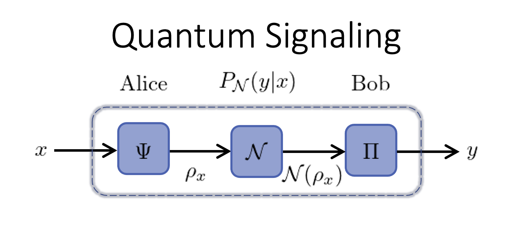

# Signaling Correlations

Consider a device that has a classical input ``x\in\mathcal{X}=[X]`` and classical
output ``y\in\mathcal{Y}=[Y]`` where ``[N]:=\{1,2,\cdots,N \}`` is a finite set of
positive integers.
The device is assumed to be causal, *i.e.* the output set ``\mathcal{Y}`` is computed
from the input ``\mathcal{X}``, however, no assumptions are made about how ``\mathcal{Y}``
is  computed  from  ``\mathcal{X}``.
Hence this device is regarded as a black-box and this description applies to all
classical technologies as well as many quantum systems used for computation and
communication.
Without loss of generality, any such black-box can be described as a *signaling device*
that transmits classical information from Alice to Bob.


The signaling device is effectively a classical channel with ``X`` inputs and ``Y``
outputs, however, the signaling process that takes ``\mathcal{X}\to \mathcal{Y}``
may use non-classical physics *e.g.* quantum physics.
Making no assumptions about the physical system inside the channel,
we can characterize its behavior by the conditional probabilities ``P(y|x)``.
We refer to these probabilities as *signaling correlations* and organize them
into a column stochastic matrix ``\mathbf{P}`` where ``P(y|x)`` is the
element in the ``y^{th}`` row and ``x^{th}`` column.
Hence ``\mathbf{P}`` represents a classical channel with ``X`` inputs and ``Y`` outputs
and we denote the set of all such classical channels as ``\mathcal{P}^{X\to Y}``.

The information capacity of a channel will typically be limited.
In the one-shot setting, we can quantify this value by ``d``, the number of distinct
classical messages used.
In a quantum system ``d`` corresponds to the Hilbert space dimension of
encoded quantum states.
For example, single bit or qubit communication corresponds to ``d=2``, while for general
``d`` we specify a single dit or qudit of communication.

To model such signaling devices, we apply the framework of [`BellScenario.jl`](https://chitambarlab.github.io/BellScenario.jl/stable/).
The signaling device is then described by the [`BellScenario.LocalSignaling`](https://chitambarlab.github.io/BellScenario.jl/stable/BellScenario/scenarios/#BellScenario.LocalSignaling)
scenario which specifies the number of inputs `X`, outputs `Y` and forward communication `d`.

```@example local_signaling_scenario
using BellScenario

X = 3    # num inputs
Y = 4    # num outputs
d = 2    # bit or qubit communication

scenario = LocalSignaling(X, Y, d)
```

Note that the constructed `LocalSignaling` type specifies the black-box configuration.

## Classical Channels


Furthermore, shared randomness can be shared between Alice and Bob (transmitter
and receiver).


As depicted in the figure, Alice sends a classical message ``m\in[d]`` to Bob.
The content of ``m`` is determined by the input ``x\in[n]`` and the encoding strategy of
the transmitter ``T_{\lambda}(m|x)``.
Likewise, Bob's output ``y\in[n']`` is derived from ``m`` using a decoding strategy of the
receiver ``R_{\lambda}(y|m)``.
The transmitter and receiver strategies are simply stochastic maps ``\mathbf{T}_{\lambda} \in \mathcal{P}^{n \to d}``
and ``\mathbf{R}_{\lambda} \in \mathcal{P}^{d \to n}``  respectively.
The sample space of the shared randomness is denoted ``\Lambda`` where the shared
random variable ``\lambda \in \Lambda`` is weighted by the probability mmass function
``q(\lambda)`` such that ``\sum_{\lambda\in\Lambda} q(\lambda) = 1``.
Alice and Bob both have access to ``\lambda`` and therefore can condition their
encoding and decoding strategies on this value.

The classical signaling correlations produced in a `LocalSignaling` scenario are
constructed by

```math
P(y|x) = \sum_{\lambda\in\Lambda}q(\lambda) \sum_{m\in[d]}R_\lambda(y|m)T_\lambda(m|x).
```

The complete set of classical signaling correlations are denoted ``\mathcal{C}_d^{n \to n'}``.
Any classical local signaling strategy ``\mathbf{P}`` satisfies ``\mathbf{P}\in\mathcal{C}_d^{n \to n'}\subset \mathcal{P}^{n \to n'}``.
The set ``\mathcal{C}_d^{n \to n'}`` forms a convex polytope regarded as the *signaling polytope*.
More details on the structure of the signaling polytope are found in the [Signaling Polytope: Overview](@ref) section.

A classical channel ``\mathbf{P}\in\mathcal{P}^{X\to Y}`` is then represented by
a [`BellScenario.AbstractStrategy`](https://chitambarlab.github.io/BellScenario.jl/dev/BellScenario/strategies/#BellScenario.AbstractStrategy) type.

### Code Example: Classical Signaling without Shared Randomness
```@example classical_channel_local_random
using BellScenario

X = 3    # num inputs
Y = 3    # num outputs
d = 2    # d-dit

scenario = LocalSignaling(X, Y, d)

T = Strategy([1 0 1;0 1 0])    # transmitter strategy
R = Strategy([0 0;0 1;1 0])    # receiver strategy

S = *(R, T, scenario)    # `Strategy` matrix multiplication : S = R*T
```

### Code Example: Classical Signaling with Shared Randomness
```@example classical_channel_shared_random
using BellScenario

X = 3    # num inputs
Y = 3    # num outputs
d = 2    # d-dit

scenario = LocalSignaling(X, Y, d)

# λ = 1 strategies
T1 = Strategy([1 0 1;0 1 0])    # transmitter strategy
R1 = Strategy([0 0;0 1;1 0])    # receiver strategy

# λ = 2 strategies
T2 = Strategy([0 0.5 1;1 0.5 0])    # transmitter strategy
R2 = Strategy([1 0;0 1;0 0])        # receiver strategy

Λ = [0.5, 0.5]    # shared random distribution

# `Strategy` matrix multiplication : S = R*T
S1 = *(R1, T1, scenario)
S2 = *(R2, T2, scenario)

# Convex combination of `S1` and `S2`
Strategy(sum( Λ .* [S1, S2] ), scenario)
```

## Quantum Channels

When quantum signals are used to communicate, Alice uses a classical quantum encoder
``\Psi`` to transform input ``x`` into a quantum state ``\rho_x``.
Bob decodes the output ``y`` using a positive
operator-valued measure (POVM) ``\Pi = \{\Pi_y\}_{y\in\mathcal{Y}}``.
The amount of quantum communication is measured by the Hilbert space dimension of
``\rho_x``.
During transmission, quantum states are subjected to processing and noise inherent to the signaling system.
These effects are modeled by a quantum channel ``\mathcal{N}`` which performs a completely
positive trace-preserving (CPTP) map.




The signaling correlations of a general quantum channel are then expressed

```math
P_{\mathcal{N}}(y|x) = \text{Tr}[\Pi_y \mathcal{N}(\rho_x)],
```

While for an ideal quantum channel, the signaling correlations are constructed as

```math
P(y|x) = \text{Tr}[\Pi_y \rho_x].
```

The set of quantum strategies are denoted ``\mathcal{Q}_{\mathcal{N}}^{n \to n'}``
where ``\mathbf{P}_{\mathcal{N}} \in\mathcal{Q}_{\mathcal{N}}^{n \to n'}\subset \mathcal{P}^{n \to n'}``.

To compute quantum signaling correlations, `BellScenario.jl` provides a [`quantum_strategy`](https://chitambarlab.github.io/BellScenario.jl/stable/BellScenario/strategies/#BellScenario.quantum_strategy) method.
As input this method requires states and POVMs to be represented by
[`QBase.States.AbstractDensityMatrix`](https://chitambarlab.github.io/QBase.jl/stable/submodules/States/#QBase.States.AbstractDensityMatrix)
and [`QBase.Obserbables.AbstractPOVM`](https://chitambarlab.github.io/QBase.jl/stable/submodules/Observables/#QBase.Observables.AbstractPOVM)
defined in the [QBase.jl](https://chitambarlab.github.io/QBase.jl/stable/) package

### Code Example: Signaling Over Quantum Channel

```@example quantum_signaling_channel
using BellScenario
using QBase

X = 3    # num inputs
Y = 3    # num outputs
d = 2    # d-dit

scenario = LocalSignaling(X, Y, d)

Ψ = States.trine_qubits             # trine qubit states
println("Ψ = ", Ψ, "\n") # hide
Π = Observables.trine_qubit_povm    # trine qubit povm
println("Π = ", Π, "\n")

# quantum signaling correlations for an ideal channel
P = quantum_strategy(Π, Ψ, scenario)
println("P = ", P,"\n") # hide

# quantum signaling correlations for a depolarizing channel
μ = 0.5    # depolarization amount 0 ≤ μ ≤ 1
P_N = quantum_strategy(Π, Channels.depolarizing.(Ψ, μ), scenario)
println("P_N = ", P_N) # hide
```
